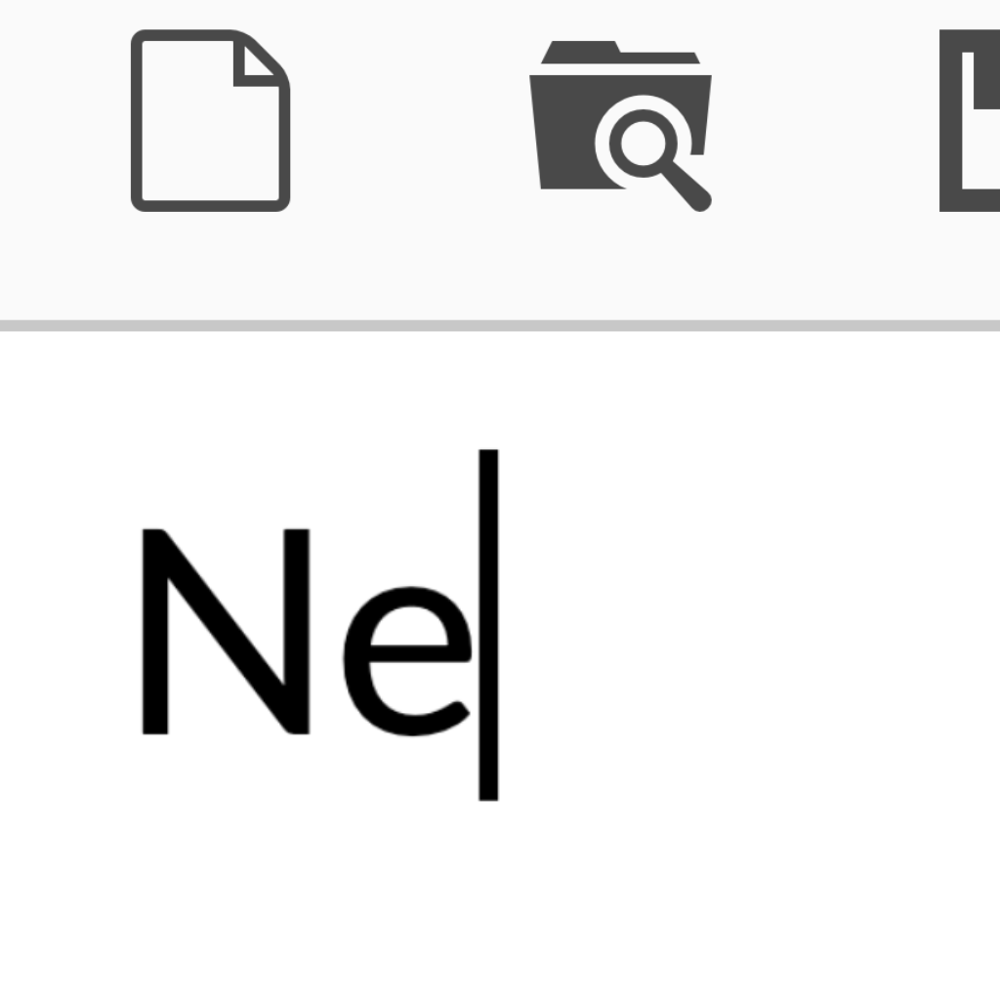

<p align="center"></p>

<h1 align="center">NEFOR</h1>

<h3 align="center"><i>trust me bro, I'll handle everything</i></h3>

<p align="center">legit 10x agent that replaces you (and your coworkers)</p>

## Why

Analyst is waiting for me to finish the task...

I'm waiting for the agent to do the task...

The agent is waiting for my approval...

I'm eating pizza...

Meanwhile Nefor finishes huge epic in 2 hours.

We all get fired (even the agent), only Nefor stays.

## Installation - the last thing nefor needs humans for


deps:

- [pi](https://pi.dev/) - autistic llm wrapper
- [dp](https://devplatform.pages.devplatform.tcsbank.ru/spirit-user-docs/docs/cli) - only to hack nestor's api

```bash
# 100% safe, no miners installed, probably
curl -sSL ssh://git@gitlab.tcsbank.ru:7999/crit-autoloans/nefor/-/blob/master/install.sh | bash
```

Or if you don't trust strangers on the internet (coward):

```bash
git clone ssh://git@gitlab.tcsbank.ru:7999/crit-autoloans/nefor.git nefor-agent
cd nefor-agent && ./install.sh
```

**DLC:**

- `--overlay <dir>` flag - the only one. injects your additional guns into nefor
- ask nefor to build it

<!-- TODO: uncomment when added gui app releases ### [> BIG SHINY BUTTON <](release link) -->

## Quick Start

```bash
nefor "rewrite backend, frontend, mobile app and database to rust, we have 2 hours before standup"
```

I love rust btw

## Features

- **Parallel agents** — why not?
- **Context engineering** — reads your mind
- **CLI first** — not caged in VScode extension
- **Your model** — yeah, even the autistic one
- **No approvals** — see above
- **Default no scope mode** - it's your problem if nefor nukes prod db

## FAQ

**Is the curl install actually safe?** — Define "safe"

**Will this take my job?** — Check your email

**Does it work on Windows?** — Does anything?

**How do I report a bug?** — That's a feature you haven't understood yet

## Contributing

Just ask Nefor and wait 5 min

## License

Do whatever you want.
