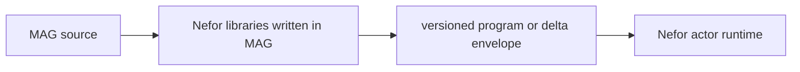

# MAG's Place Inside Nefor

Nefor's MAG libraries define node and graph values plus two explicit artifact
boundaries. A complete-graph artifact describes capability actors, transformed
routes and messages, structural types, logical node paths, one `StoredBoundary`
result, and any closed declarative operations. Fixed combinators are compile-time
boundary transforms, never runtime entities. A delta artifact contains only the
operational changes allowed against a live run. Core MAG serializes the value
supplied to `artifact`; the Nefor runtime validates and interprets the
application-owned envelope.



Most authors work with `Node<I, O>` and compose larger nodes from smaller ones.
The graph layer places the final node into a runnable topology; the actor runtime
interprets the lowered envelope.

## Complete graphs and live changes

For the common one-terminal workflow, `nefor.artifact.compile_graph` closes an
already-composed root-capable node by selecting its terminal endpoint, then applies graph
validation, and lowering machinery:

```mag
nefor.artifact.compile_graph(workflow)
```

At the advanced layer, authored topologies are pure `fn(Graph) -> Graph`
transformations. `nefor.artifact.compile` applies the transformation to
`empty_graph`, validates the complete result, lowers it, and returns a version-4
program envelope:

```mag
nefor.artifact.compile(
  ((|graph| => nefor.graph.add_edges(graph, [
    nefor.graph.edge(start, worker),
    nefor.graph.edge(worker, result)
  ])): fn(nefor.graph.Graph) -> nefor.graph.Graph)
)
```

Before compilation, another pure function may add or remove edges and return a
new graph. Compilation does not retrieve, mutate, or cache a stored graph.

A running graph changes through a `Delta`, which contains only capability actors,
transformed routes and messages, kills, structural types, and logical paths for
newly introduced nodes:

```mag
let change = nefor.graph.delta_message(
  nefor.graph.node_delta(worker),
  get(worker, "input"),
  task
)

nefor.artifact.delta(change)
```

The result is a version-4 delta envelope. The control plane may submit it with
`mag.apply` to one identified live run. Application is atomic and cannot rewrite
an existing actor, revive a killed identity, add operations, or replace the
run's result boundary. Replacement therefore uses a fresh actor id. Existing
endpoint definitions and their routes remain immutable.

Runtime-driven expansion is declared in the original program as ordered
`InstantiateDeltaTemplate` operations. Each operation subscribes to one typed
output and materializes one structural delta template through the closed
version-4 expression vocabulary. Actors still have no authority to mutate the
graph.

## Closed immutable envelopes

`mag.load` compiles a source tree and returns the exact immutable artifact plus
its content hash for validation and preview. It retains no compiler environment
or executable function handle. The returned envelope may be stored, copied, or
executed after its source is gone.

The runtime boundary is deliberately closed:

- `mag.execute` accepts only an inline `{format: "nefor.mag", version: 4,
kind: "program"}` envelope;
- `mag.apply` accepts only an inline `{format: "nefor.mag", version: 4,
kind: "delta"}` envelope;
- raw unversioned modifications are rejected at both protocol operations; and
- a program contains one operation vocabulary, currently only
  `InstantiateDeltaTemplate` with `Trigger`, `Capture`, `Field`,
  `IntToDecimalString`, and `ConcatStrings` expressions.

Version 4 has no artifact cache, general runtime expression language,
post-compilation function application, source or bytecode payload, nested
operation, or conditional/template-programming facility.

The concrete initial payload has the `Modification` type defined in
[`nefor/graph.mag`](../../lib/nefor/graph.mag):

```mag
type Modification {
  actors: List<LowerActor>,
  routes: List<LowerRoute>,
  messages: List<LowerMessage>,
  kills: List<String>,
  types: Map<String, TypeDescriptor>,
  nodes: List<LogicalNode>,
  result: ResultBoundary
}
```

Concrete actors carry factory identities, concrete type arguments, parameters,
and typed ports. Fixed combinators (`Unit`, `Project`, `Pack`, `Unpack`,
`Assemble`, `EmptyList`) are ordered `Transform` values carried by route and
message definitions; their `Assemble` state is owned by the concrete
destination and structural path, with FIFO queues for explicit slots. Routes
are top-level definitions between nominal `ActorEndpoint` values. Messages
carry the same actor destination plus their transform sequence. `result.from`
is a `StoredBoundary` containing actor-output leaves and through flows, so it
observes transformed values without an output actor. The runtime validates the
complete payload before registering actors or installing routes.

`LogicalNode` carries a non-empty path of local name segments and the opaque
runtime actor IDs owned directly at that level. Parent paths must exist, every
complete path must be unique, and every actor belongs to exactly one logical
node. Actor IDs and logical paths are separate identities: a dot in an actor ID
is never split into path segments. Explicit `node_named` hierarchy is
presentation and composition structure, not an actor-identity namespace.
