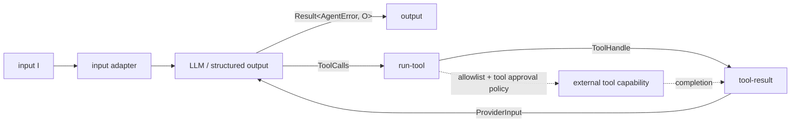

# Graphs as Library Data

[`nefor/graph.mag`](../../lib/nefor/graph.mag) defines `Port`, `Node`, `Edge`,
and `Graph` as nominal MAG types. The user-facing center is `Node<I, O>`; ports
and stored routes are its representation and remain available for advanced live
modifications.

## Actors

An actor is one runtime capability with a stable identity, a factory identity,
typed input and output ports, type arguments, and packed parameters. A factory
may implement an LLM request, process execution, tool coordination, a human
approval, or an adapter. The graph treats each actor as a black box whose
observable contract is its ports and messages.

Actor-specific MAG libraries define the parameter records and construct the
actors. The runtime instantiates each actor through its factory; it does not
receive one monolithic workflow configuration and infer hidden steps.

## Node boundary

A `Node<I, O>` composes capability actors, pure topology junctions, their internal routes, declarative operations,
and any explicit messages behind one typed input and output boundary. The
completed topology owns initial activation: each exposed, unfed node boundary
whose complete input type is exactly `Unit` gets one bootstrap message during lowering.
A nominal ADT or product merely containing
`Unit` does not. An incoming route or explicit input message keeps the node
dependency-driven, and internal actors are never independently bootstrapped
through a composite boundary. The functions in
[`nefor/node.mag`](../../lib/nefor/node.mag) compose these values directly:
`>>>`, `*>`, `fanout`, `parallel`, `choose`, and `sequence`. An `Edge` connects
the final node to the surrounding topology. Compatibility is checked before the
artifact exists.

Operations are immutable program data, not graph edges or executable MAG
functions. Version 3 has one operation,
`InstantiateDeltaTemplate`, for runtime-sized structural expansion.

Graph composition is an identity union, not tree expansion. Reusing one bound
node contributes its actor, junction, route, operation, logical-node, and exact message
definitions idempotently, in first-occurrence order. The reused actor remains
one runtime actor: Nefor neither clones its execution nor adds a memoization
layer. Distinct routes from that actor are all retained, so one result can still
feed several downstream nodes. Exact repeated messages collapse as definitions;
messages with different content remain distinct even when they target the same
port.

An identity is also an immutable contract. Actors compare their complete
factory, type, parameter, port, and templateability definition. Junctions compare their closed operation and typed ports. Stored nodes
compare role, typed boundaries, and the complete sets of actor, junction, route, message,
and operation definitions; set order is irrelevant, but adding, removing, or
changing any execution definition changes the node. Logical hierarchy metadata
is checked separately. Routes compare both typed ports, operations compare the
complete operation, and logical nodes compare complete membership at a path. A
repeated compatible definition disappears from the emitted program. A
divergent definition never wins by order: compilation reports both definitions
and the child occurrence that introduced each one, including its actual logical
paths and nested composition side or sequence index.

## An agent node

[`nefor.actors.agent`](../../lib/nefor/actors.mag) is the reusable generic
constructor. It accepts a configuration-owned typed model resolver and a
complete `AgentConfig`, including `ToolApprovalPolicy`, and returns
`Node<I, core.types.Result<AgentError, O>>`. A distribution may close over its
own model vocabulary and resolver with concise constructors, as the starter's
`agents` module does. Both boundaries hide the provider/tool loop while
preserving every terminal result type.

The stored node has exactly four actors: the input adapter, the LLM (or
structured-output factory), `run-tool`, and `tool-result`. `run-tool` receives
the tool allowlist and normalized approval metadata as parameters. An authored
`Rules(ToolApprovalRules)` value retains its exact rule map through that
normalization, but the tool gate does not enforce those per-agent rules; its
configured policy and validator own authorization. The dashed path is
capability work outside the stored actor graph; the policy and tool execution
are not two extra actors hidden inside the node.

The
[`typed-task.mag`](../../../examples/nefor-agent/agentic-loop/typed-task.mag)
example composes the agent node between a source and output.
