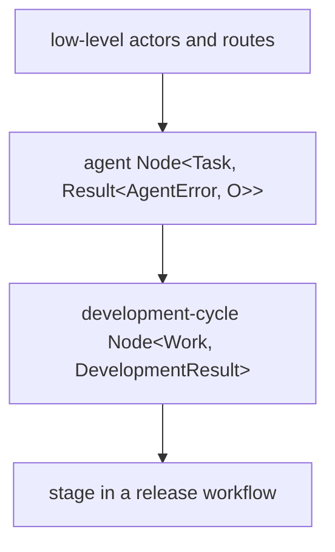
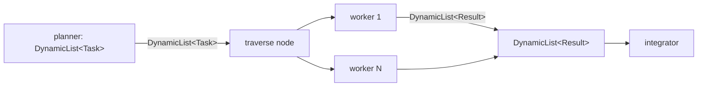
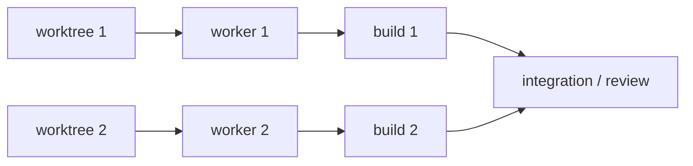

# Hierarchical Composition

Ordinary MAG functions can return nodes containing lower-level capability actors
and routes. Fixed combinators remain compile-time boundary transforms carried by
those routes and boundaries; they do not become runtime rows. The returned
`Node<I, O>` can then be bound and composed as one value.



Each layer preserves its input and output types while hiding its internal
mechanics. Lowering expands executable capabilities into actors and carries
fixed boundary/route transforms alongside routes and messages, while also
retaining authored node paths as presentation metadata.

The basic composition vocabulary mirrors established functional abstractions:

```text
>>>      : (Node<A, B>, Node<B, C>) -> Node<A, C>
*>       : (Node<A, B>, Node<Unit, C>) -> Node<A, C>
&&&      : (Node<I, A>, Node<I, B>) -> Node<I, (A, B)>
***      : (Node<A, B>, Node<C, D>) -> Node<(A, C), (B, D)>
choose   : (String, Node<A, C>, Node<B, D>) -> Node<Either<A, B>, Either<C, D>>
sequence : List<Node<I, O>> -> Node<I, List<O>>
traverse : (String, Node<I, O>) -> Node<DynamicList<I>, DynamicList<O>>
```

These are library functions, not syntax or a mandatory architecture. A small
one-off workflow may stay direct. Repeated or independently meaningful pieces
can become ordinary node-producing functions, exactly as in other code.

A bound node value is reusable graph structure. If two composed branches refer
to the same child identities, composition unions those definitions and emits
them once; it does not duplicate actors or deliver an extra root activation.
Each destination owns its transformed route and any `Assemble` FIFO cohort;
structural paths and explicit slots keep equal-typed inputs distinct. Reuse
therefore means “the same runtime identity participates in both structures,”
not “run this computation twice” and not “cache a prior result.” Use different
actor IDs when two independent executions are intended.

This law applies equally inside result combinators and closed `traverse`
workers. Dynamic traversal first closes the worker under the same identity
union, then gives that one closed definition fresh occurrence-scoped runtime
IDs for each dynamic item.

`>>>` is hierarchy-transparent. It connects two nodes without inventing a
parent, so a long pipeline does not become a binary staircase. Use `node_named`
only when a function has produced a real abstraction boundary that should
collapse as one node. `rename` gives that placed value a concise local label
without rewriting its opaque runtime actor ID.

Hierarchy is represented by paths of local names:

```text
["camera-stage"]
["camera-stage" "agent"]
["camera-stage" "agent" "llm"]
["camera-stage" "retry"]
```

Every complete path is unique within the run. Runtime actor IDs are separate,
opaque identities. A dot in an actor ID is an ordinary character: implementations
must not split it to derive path segments or parentage. `node_named` intentionally
creates a hierarchy boundary in these paths; it does not rename or create an
actor identity. `rename` changes one displayed path segment without rewriting an
opaque actor ID. The run itself is the display root, so its direct children
appear immediately; there is no mandatory one-node wrapper around the complete
workflow.

## Runtime-sized graphs

`sequence` covers fixed fan-out: its MAG `List<Node<I, O>>` fixes producer
count and result order while compiling. `DynamicList<T>` is different. It is
the producer-side protocol for dynamically many indexed `T` occurrences
followed by explicit completion; it is not a runtime-sized MAG container value.
Consumer operations retain that same nominal boundary: traversal activates once
per occurrence, while context activates once with the ordered list after
completion.



A dynamic producer is an ordinary selected agent output:

```mag
import agents.{}
import core.types.{}
import nefor

let planner = agents.agent<Task, DynamicList<Followup>>("planner", planner_config)
let worker = agents.agent<Followup, Finding>("followup-worker", agents.AgentConfig {
  model: agents.standard,
  system: "Consume the typed Followup and return its Finding.",
  tools: read_only_tools,
  tool_approval_policy: named(ToolApprovalPolicy, Default, nil),
  max_corrections: 2
})
let workers = traverse("followups", worker)
let completed = context<core.types.Result<AgentError, Finding>>("findings-context")
```

`traverse(id, worker)` accepts the same ordinary `Node<I, O>` used elsewhere
and returns `Node<DynamicList<I>, DynamicList<O>>`. Its closed template references
capability actors only; fixed transforms stay on its routes and messages. No
public template node, reference language, or separate dynamic-agent constructor
is involved.
`context<T>(id)` waits for explicit completion and sends one ordered provider
turn to its consumer, including when the collection is empty.

## Resources in dataflow



Each worktree node emits a typed `Worktree` value for an agent input. A
deterministic command's parameters are fixed when the artifact is constructed,
so the workflow binds the requested worktree path once and reuses that string
both in the worktree specification and the command's `cwd`. The worktree result
still reaches the agent through an ordinary typed edge.

The executable graph may be large, but its logical hierarchy survives lowering
for inspection. Within every set of siblings, the TUI performs a deterministic
best-effort linearization from entries toward exits. Arbitrary directed graphs
and feedback cycles remain valid: when a cycle prevents a complete topological
ordering, declaration order breaks the tie and the feedback edge points back
through the displayed sequence. This changes representation only, never runtime
scheduling.
