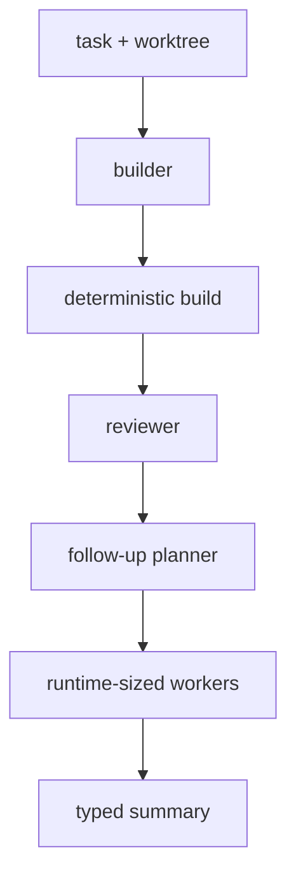

# Development Workflows

An SDLC-shaped graph demonstrates local types, node-producing functions,
deterministic capabilities, resources, and runtime-sized work in one
composition.



The builder performs judgment; the process node reports deterministic build
facts; the reviewer performs a second judgment. These remain an ordinary
static node pipeline. When a runtime value determines the number of follow-ups,
a selected agent produces `DynamicList<Followup>` and `traverse` applies one
ordinary typed worker node to every occurrence.

## Project-specific code

The workflow's command, policy, result classification, and builder input are
local values. Their relationship is visible where they are defined:

```mag
import nefor

type BuildPassed {stdout: String}
type BuildFailed {
  stdout: String,
  stderr: String,
  termination: ProcessTermination
}
type BuildFeedback = BuildPassed(BuildPassed) | BuildFailed(BuildFailed)

let build_passed: fn(ProcessResult) -> BuildFeedback = |result| =>
  named(BuildFeedback, BuildPassed, BuildPassed {
    stdout: get(result, "stdout")
  })

let build_failed: fn(ProcessResult) -> BuildFeedback = |result| =>
  named(BuildFeedback, BuildFailed, BuildFailed {
    stdout: get(result, "stdout"),
    stderr: get(result, "stderr"),
    termination: get(result, "termination")
  })

let classify_build: fn(ProcessResult) -> BuildFeedback = |result| =>
  match get(result, "termination") {
    case ProcessExited(exited) =>
      if (=)(get(exited, "code"), 0) then build_passed(result) else build_failed(result),
    case ProcessSignaled(signaled) => build_failed(result)
  }
```

The termination constructors are the branch evidence. The workflow does not
duplicate them as string fields, and exhaustive `match` keeps every process
outcome visible.

The workflow itself should be a short local node-producing function. Nefor's
shared library supplies graph, agent, process, worktree, and runtime-collection
mechanisms; it does not choose a project's SDLC. The complete progression is in
[Nefor MAG in Five Minutes](<00. Nefor MAG in Five Minutes.md>), including a
reviewer that returns meaningful `ReviewComment {path, line, body}` values.

For runtime-sized work, select `DynamicList<T>` as an ordinary agent output and
pass an ordinary `Node<I, O>` to `traverse(id, worker)`. The result is
`Node<DynamicList<I>, DynamicList<O>>`. Use `context<T>(id)` when the consumer
must activate once with the ordered collection after completion. Fixed worker
lists use `sequence`. Public authoring needs no template nodes, reference
expressions, or separate dynamic-agent constructor.

Feedback that requires an arbitrary runtime program or post-compilation
function call is outside the version-4 operation model; model that policy as an
ordinary bounded node or let the control plane compile and apply an explicit
delta.

The repository examples are read-only references. During a session, the lead
writes task-specific MAG source into that session's writable workspace. Its
ambient context names the selected immutable module roots and MAG Book; neither
the libraries nor the book are copied into the session.
